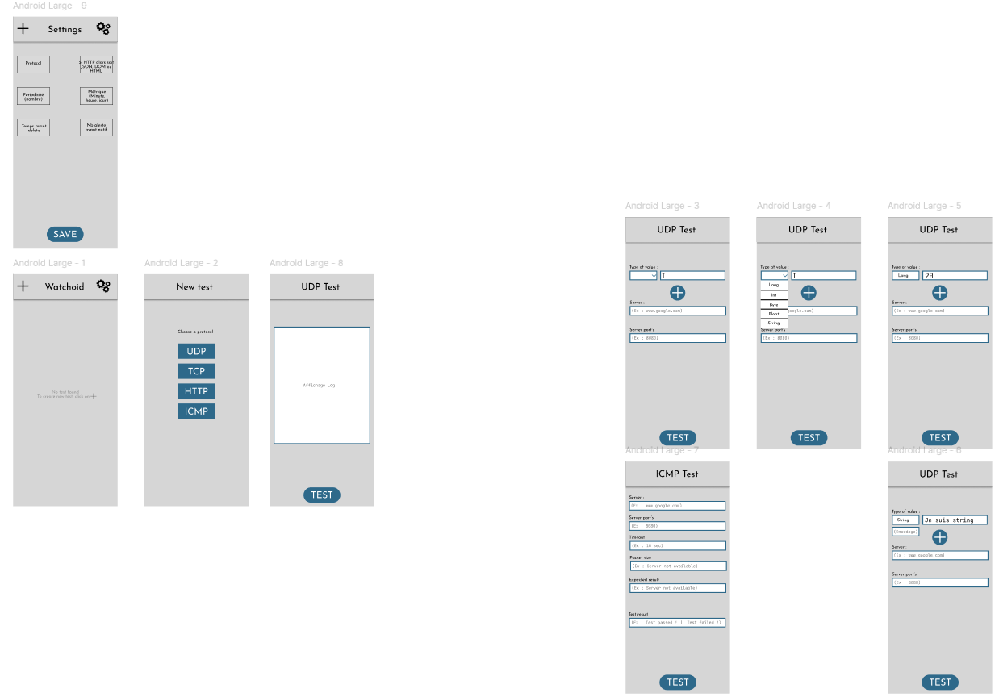

# Contribution Mathéo BOURDELAT

Dans un premier temps, je tiens à signaler que je n'ai jamais coder d'application android de ma vie et ce fut une première pour moi. Dans ce document, je vais décrire ce que j'ai fais pour le projet, pourquoi et comment je les ai faite.

## Interface Graphique

Tout d'abord, avec Ilyass, nous nous sommes réparti le travail de la manière suivante : 

- Mathéo : Test ICMP et UDP
- Ilyass : Test TCP et HTTP

J'ai d'abord commencer a faire quelques tests de mon côté sur le protocol UDP. Sauf que je me suis dis, que ça serais mieux de commencer par l'interface graphique dans sa globalité, comment va être la page d'accueil, la page pour choisir les protocols, etc ... 
J'ai commencé à faire une maquette sur figma pour avoir une idée de comment l'application devrait rendre : 



Puis par la suite j'ai commencé à coder la page d'accueil, ainsi que la page "Protocol_Chooser", permettant de choisir quel type de test l'utilisateur aimerais faire. C'est à ce moment là que j'ai eu l'idée de créer les composants Background et NavigationButton. Background car chaque page de l'application allait avoir le même fond. NavigationButton est un composant exclusivement utilsé dans Protocol_Chooser. Ce dernier est un button redigirant vers l'un des 4 tests. 

C'est aussi à ce moment là où j'ai fais la page des settings et celle des alertes.

Quand le coeur du projet était créer c'est là que j'ai codé les algorithmes pour le protocole UDP et ICMP ainsi que la base de donnée mais les explications sur ces point là arriveront plus tard.

J'ai également fait la page des logs que Ilyass à améliorer avec directement une table Log en base de donnée. Dans cette page il y a 4 buttons, 1 par protocole. Le clique sur l'un de ses buttons affiche des informations détaillés pour chaque test (Adresse IP destination, port, Test attendu, Résultat du test, ...).

Au moment où moi et Ilyass avont bien avancé sur le projet, que ce soit sur les protocoles ou les différentes fonctionnalités, j'ai implémenté mon mini jeu. C'est un jeu appelé TapTap au concept assez simple. Le but du jeu est de cliquer le plus de fois sur son écran dans un temps impartis (10 secondes) et de battre le meilleure score qui est stocker en base de donnée.

## Protocole

Comme dit plus haut, je me suis occupé des tests UDP et ICMP.

### UDP 

Les tests UDP sont construit de la manière suivante : 

- Étape 1 : L'utilisateur choisis les données qu'ils souhaite envoyé au serveur (Int, Float, Long, Double, String)
- Étape 2 : L'utilisateur rentre l'adresse et le port du serveur de destination
- Étape 3 : L'utilisateur choisis les données que le serveur devrait lui renvoyer (Int, Float, Long, Double, String)
- Étape 4 : L'utilisateur choisis la périodicité du test pour les tests automatiques

Avec ce qu'on a vu en cours, les tests UDP était assez simple. J'ai utilisé un ByteBuffer pour envoyer et recevoir les données du serveur.

Pour les données envoyés au serveur, j'ai créé une DataClass RowComponent prenant en paramètre, une valeur, un type, un charset et un booléen isChecked pour savoir si on met la taille de la string dans le buffer. J'ai stocker tous les RowComponent dans une liste où j'itère dessus pour ajouter les élément à mon buffer d'envoie. 
Pour les données reçu, j'ai créé une DataClass ResponseComponent prenant en paramètre, une valeur, un type et un charset. Je stocke une liste de ResponseComponent qui est une liste où je stocke toutes les données que le serveur est censé nous renvoyé.

Après le test effectué je stocke le résultat en BDD.

### ICMP

Les tests ICMP sont construit de la manière suivante : 

- Étape 1 : L'utilisateur rentre l'adresse et le nombre de packet qu'il souhaite envoyé au serveur
- Étape 2 : L'utilisateur choisis le type de test (Server Availability ou Max Reponse Time)
- Étape 3 : L'utilisateur rentre True ou False pour un test de type Server Availability ou bien le temps maximal d'un aller retour que puisse faire les packets pour un test de type Max Reponse Time
- Étape 4 : L'utilisateur choisis la périodicité du test pour les tests automatiques

Pour pouvoir ping un serveur distant, j'utilise la commande ping que l'on peut trouver sous linux : 

Un exemple : 

```java
val command = "ping -c ${nbPacket.value} ${serverAddress.value}"
val process = Runtime.getRuntime().exec(command)
val reader = BufferedReader(InputStreamReader(process.inputStream))
```

Puis en fonction du type de test je fais appelle a 2 fonction, soit une qui s'appelle ping permettant de juste ping et qui vérifie que aucun packet ne s'est perdu en chemin. Ou bien, une autre fonction s'appellant pingMaxTime récupérant les données du ping.

Par la suite je récupère les données de chaque fonction et je les analyse, s'il y a des données qui se sont perdu alors le test ne passe pas. Ou bien si l'un des paquets à depassé le temps maximale défini par l'utilisateur alors le test ne passe pas non plus.

J'ai aussi fait un affichage de quand le test passe.

### Pour chaque test UDP et ICMP

Pour les test, j'ai implémenter un bouton, "Ajouter un test", permettant de créer plusieurs test dans une même page. Les tests sont créer l'un à la suite des autres et sont délimiter par une barre.

J'ai egalement repris les travaux d'Ilyass sur l'automatisation des test TCP et je les ai adapté en fonction des tests UDP et ICMP. Et donc par la suite modifié le fichier "Services", pour que tous les tests puisse le lancer automatiquement.

## Base de donnée

J'ai implémenter le plus gros de la base de donnée que après nous avons modifier pour nos besoin. J'ai créer les tables : 

- Alerts
- HTTPTest
- TCPTest
- UDPTest 
- ICMPTest
- TapTap
- Settings

Avec à chacune des tables leur Entity et leur DAO. 
Pour les tables : 
- HTTPTest
- TCPTest
- UDPTest 
- ICMPTest

J'ai du créer une une fonction spéciale nommé selectAllFrom, permettant de récupérer les données de n'importe quelle table. Très utile pour afficher les données des tables dans les logs. Car je créé une liste de any, où je met toutes les données du type de test dans la liste. Puis au moment où je veux afficher la liste, je cast la liste en UDPPTest, ICMPTest, TCPTest ou HTTPTest en fonction du besoin.

J'ai aussi, dans chaque test :
- Implémenter le faite que dès qu'un test ne fonctionne pas son compteur d'alerte augmente
- Qu'il soit intégrer dans la base de donnée

Pour ce qui est des champs de chaque table de test, au tout début je les avait de la même manière puis nous les avons modifier en fonction de nos besoin.

Pour ce qui est du stockage de liste dans la base de donnée (car à un moment dans le code je stock une liste de string pour les tests UDP), j'ai dû créer un Converter de liste pour Room DB.

## Autre

Pour les notifications qui doivent s'envoyer lorsqu'un test atteind le nombre d'alerte définis dans les paramètres, cela envoie une notifications. Cette fonctionnalité je l'ai commencé, j'ai fais les base et Ilyass l'a terminé de son côté.

Tous les composants qui sont dans le répertoire "Composant" c'est moi qui les ai fait.